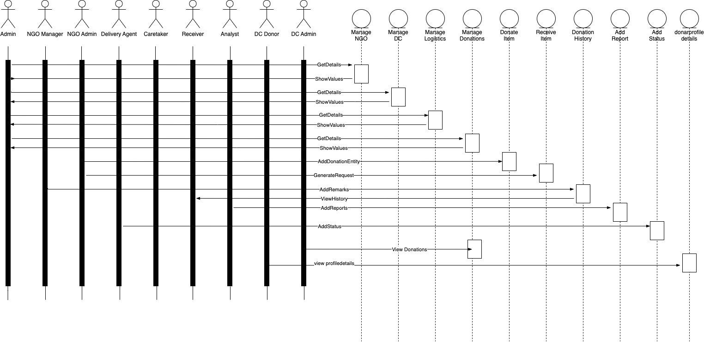

# FINAL PROJECT DOCUMENTATION

TEAM MEMBERS

Siddharth Dash

Sourabh Kumar 

## OVERVIEW
- A Java Swing application was created to support children across geographical boundaries with a centralized, integrated, and worldwide management system to address the donation issue and meet the needs of recipients in the Non-Governmental Organization (NGO) sector.
- We want to bring together all the businesses—NGOs, analysis, supply chains, and donation centers—needed to facilitate the global contribution management system in "NGO Donation Management System."
- This application would make it possible to take care of recipients like kids so they don't go without necessities, which would be extremely beneficial for their growth.
- Implemented features that facilitate the supply chain between NGOs and donation centers, the management of donations by donation centers, and receivers of items. The NGO Enterprise will have a manager who will monitor all donated items and donor information, and the administrative organization will have an admin who will develop and handle the entire system. An analyst who is in charge of the analysis and will record all different kinds of donations. At the Supply Chain Enterprise, handlers will oversee all transport. For the Donation Center Enterprise, an administrator will be in charge of donors, and inventory managers will be in charge of all donation categories there.
- Used db4o object database to persist data in the application.
- Incorporated email feature using email jar that notifies the user while registering.
- Displayed bar graph, line graph, and pie chart using jFreeChart jar for visualization of data.
- Authorised roles and functions for the system containing multiple roles, organizations, and enterprises across various networks.
- We aspire to minimize the end-to-end lifecycle of recipient received donated items which includes multiple operations.

## STRUCTURE

- Enterprise 1: NGO 

| Organisation | Role |
| ------ | ------ |
| Donation |  Manager, Donar|
| Administration  | Caretaker, Admin |

- Enterprise 2: Analyis

| Organisation | Role |
| ------ | ------ |
| Reporting |  Analyst |

- Enterprise 2: Supply Chain

| Organisation | Role |
| ------ | ------ |
| Logistics |  Delivery Agent |

- Enterprise 2: Donation Centre

| Organisation | Role |
| ------ | ------ |
| Donation Centre Administration |  Donar Admin, Donar|
| Inventory Department  | Inventory Manager |

## SEQUENCE DIAGRAM

## UML DIAGRAM

## Installation Requirement

- NetBeans
- Must have JDK 8 and above 
- Download jFreeChart.jar, db4o.jar, activation.jar

